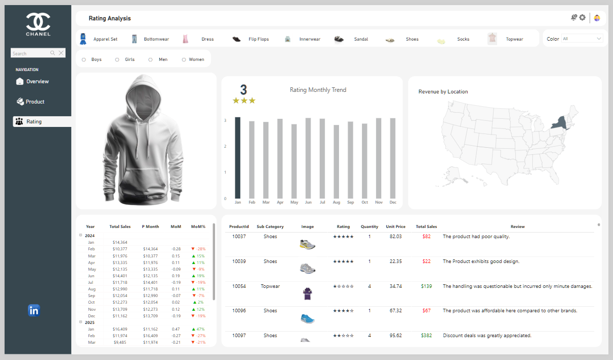

# Fashion Sales and Rating Dashboard Report

## Introduction
This project focuses on building an interactive and insightful dashboard for a fashion brand using Power BI. The aim is to help stakeholders gain a comprehensive understanding of product performance, customer ratings, and sales trends across different channels and categories. With the growing competition in the fashion industry, leveraging data to drive business decisions is more crucial than ever.

## Problem Statement
The company needs a centralized dashboard that can:
- Track and compare product performance over time.
- Identify top-performing categories and colors.
- Understand customer satisfaction through ratings and reviews.
- Analyze sales by different locations and channels.
- Support decision-making for inventory planning and marketing strategies.

## About the Dataset
The dataset comprises transactional data related to various fashion products, including sandals, shoes, topwear, flip-flops, and innerwear, categorized by gender. Each transaction contains essential attributes such as:
- Product Type, SubCategory, Title, and Image
- Order Date, Month, and Year
- Sales Quantity, Unit Price, and Total Sales
- Ratings and Customer Reviews
- Location and Sales Channels (e.g., Distributor, Online, Retail)

### From the data model, we observe four core tables:
- Fashion (fact table containing transactional and product-level data)
- Dim_Date (date dimension for time-based analysis)
- ChannelTable (categorical mapping for sales channels)
- Calculations (measures and calculated fields for KPIs like average rating, color coding, etc.)

## Power BI Concepts Applied
The following Power BI features and functionalities were utilized:
- Data Import and Transformation: Using Power Query to clean and shape data.
- Relationships & Star Schema: Establishing one-to-many relationships for efficient filtering and slicer interactions.
- DAX Measures: Creating KPIs like Avg_Rating_Stars, Total Sales, and Bar Color.
- Visualizations: Leveraging cards, bar charts, pie charts, trend lines, maps, and image visuals.
- Drill-through and Tooltips: Enabling detailed analysis at product and customer levels.
- Slicers & Filters: Allowing users to filter data by gender, category, and color.

## Data Modeling
The model follows a star schema approach:
- The central Fashion fact table holds core transactional data.
- It connects to dimension tables like:
- Dim_Date (for time-based analysis)
- ChannelTable (for channel-based filtering
- The Calculations table holds reusable DAX measures and logic to simplify the report-building process and enhance performance.
- This model ensures optimized relationships and efficient data retrieval for visual interactions.

## Visualization
Three core report pages were built:
### Overview Page:
Grid display of all sandal products with images, descriptions, and filtering by gender and category.

[Interact with dashboard here](https://app.powerbi.com/view?r=eyJrIjoiNjM1MWQyOGMtNjBjZS00ZDdlLWFiY2MtY2IzZjM2YmVjZjczIiwidCI6IjZiYjI1Yjk2LTlhZTItNDkxMy1hZTYxLThmOGE3NDNjYTY5NiJ9)

### Product Analysis Page: 
- KPIs (Revenue, Orders, Unit Price, Avg Rating)
- Sales trend line
- Top-selling colors
- Sales by channel (doughnut chart)
- Image carousel of products

 

### Rating Analysis Page:
- Rating trend across months
- Reviews and sentiment insights
- Revenue by U.S. location (map)
- Detailed table showing quantity, price, total sales, and reviews.

  

## Discussion
From the dashboard:
- Black and white products are top-performing in terms of color preference.
- Distributor channel contributes 19% of total sales, with room to increase direct online sales.
- Product 10097 stands out with the highest rating and total sales of $382, indicating strong market reception.
- Negative reviews, such as for product 10037, highlight quality issues that could affect brand reputation.
- Sales show fluctuations throughout the year, with noticeable drops and spikes in certain months (e.g., a dip in September and peak in October).

## Conclusion and Recommendation
The Power BI dashboard effectively brings clarity to product performance and customer satisfaction.

## Recommendations:
- Improve Quality Control: Focus on products with consistent low ratings.
- Boost Online Sales: Allocate resources to enhance the online channel performance.
- Optimize Inventory: Use top-selling color and category data to manage stock effectively.
- Marketing Campaigns: Leverage high-performing products like 10097 in promotions.
- Regional Strategies: Focus efforts on locations with strong revenue potential, such as New York.
